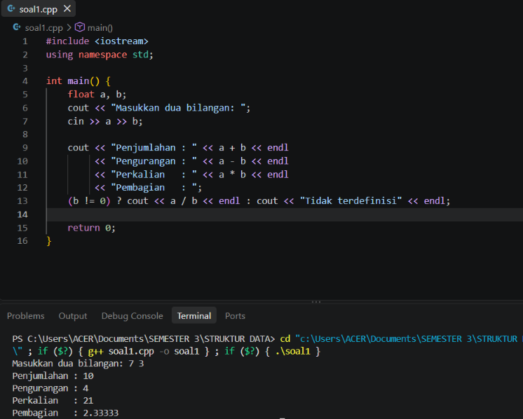
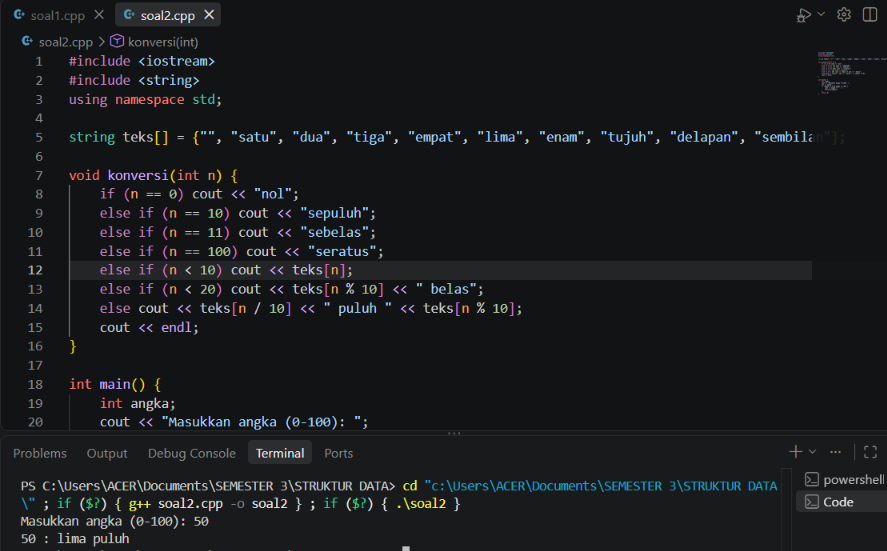
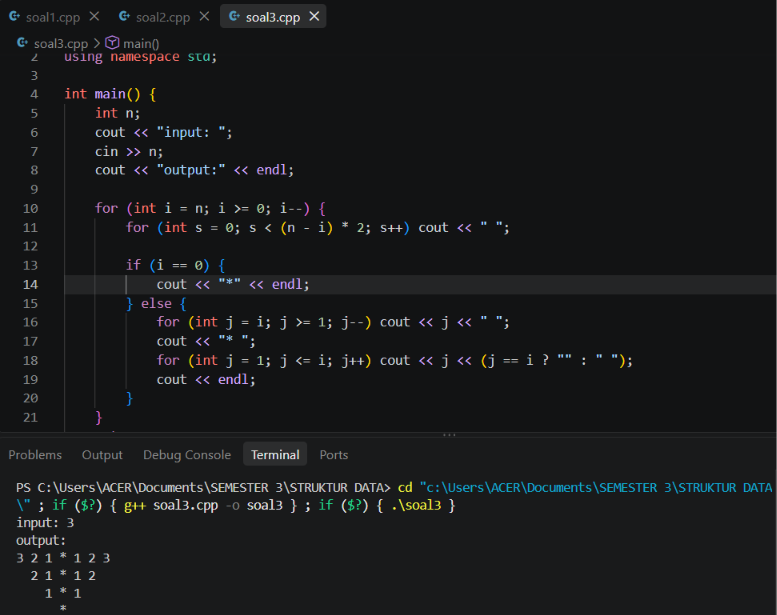

# <h1 align="center">Laporan Praktikum Modul 1 - Codeblocks IDE & Pengenalan Bahas C++ (Bagian Pertama)</h1>
<p align="center">Muhammad Rozi Lazuardi - 109082500188</p>

## Dasar Teori

### 1. Code Blocks IDE dan Bahasa C++

*Integrated Development Environment* (IDE) merupakan perangkat lunak untuk mengembangkan program. **Code Blocks** adalah IDE *open-source* dan *cross-platform* yang memfasilitasi penulisan, kompilasi (*build*), hingga eksekusi program C/C++ [1]. Bahasa C++ sendiri merupakan perluasan dari bahasa C yang mendukung pemrograman berorientasi objek [2]. C++ bersifat *case sensitive* dan memiliki struktur dasar berupa *header file*, deklarasi variabel/konstanta, serta fungsi utama (`main`).

### 2. Tipe Data, Variabel, dan I/O

* **Pengenal (Identifier) & Tipe Data:** Identifier adalah nama untuk variabel, konstanta, atau fungsi. Tipe data dasar C++ meliputi `char`, `int`, `float`, dan `double`.


* **Variabel & Konstanta:** Variabel menyimpan nilai yang dapat diubah, sedangkan konstanta (`const` atau `#define`) menyimpan nilai tetap.


* **Input/Output (I/O):** Pengelolaan I/O menggunakan pustaka `<iostream>`. Perintah `cin` digunakan untuk menerima input (*standard input*), sedangkan `cout` untuk menampilkan output (*standard output*).


### 3. Operator dan Kontrol Alur Program

* **Operator:** Meliputi operator aritmatika (`+`, `-`, `*`, `/`, `%`), *increment/decrement* (`++`, `--`), serta operator relasional dan logika (`==`, `&&`, `!`) [3].


* **Struktur Kondisional:** Digunakan dalam pengambilan keputusan menggunakan pernyataan `if`, `if-else`, atau `switch`.


* **Struktur Perulangan:** Mengulang blok kode selama kondisi terpenuhi menggunakan `for`, `while`, atau `do-while`.


### 4. Tipe Data Bentukan (`struct`)

*Structure* (`struct`) adalah tipe data bentukan yang mengelompokkan beberapa variabel dengan tipe data berbeda ke dalam satu nama entitas tunggal [4].

---

### **Daftar Pustaka**

1. Code::Blocks Team. (2016). *Code::Blocks IDE User Manual*.
2. Stroustrup, B. (2013). *The C++ Programming Language*.
3. Kernighan, B. W., & Ritchie, D. M. (1988). *The C Programming Language*.
4. Malik, D. S. (2017). *Data Structures Using C++*.

## Unguided 

### 1. Buatlah program yang menerima input-an dua buah bilangan betipe float, kemudian memberikan output-an hasil penjumlahan, pengurangan, perkalian, dan pembagian dari dua bilangan tersebut. 

```C++
#include <iostream>
using namespace std;

int main() {
    float a, b;
    cout << "Masukkan dua bilangan: ";
    cin >> a >> b;

    cout << "Penjumlahan : " << a + b << endl
         << "Pengurangan : " << a - b << endl
         << "Perkalian   : " << a * b << endl
         << "Pembagian   : ";
    (b != 0) ? cout << a / b << endl : cout << "Tidak terdefinisi" << endl;

    return 0;
}   
```
### Output Unguided 1 :

##### Output 


Program menerima input dua bilangan desimal (a dan b) lalu menghitung operasi penjumlahan, pengurangan, perkalian, dan pembagian.   Logika utama menggunakan ternary operator (b != 0) ? ... : ... pada baris 13 untuk mengecek pembagi agar tidak terjadi error pembagian dengan nol.

### 2. Buatlah sebuah program yang menerima masukan angka dan mengeluarkan output nilai angka tersebut dalam bentuk tulisan. Angka yang akan di- input-kan user adalah bilangan bulat positif mulai dari 0 s.d 100 

```C++
#include <iostream>
#include <string>
using namespace std;

string teks[] = {"", "satu", "dua", "tiga", "empat", "lima", "enam", "tujuh", "delapan", "sembilan"};

void konversi(int n) {
    if (n == 0) cout << "nol";
    else if (n == 10) cout << "sepuluh";
    else if (n == 11) cout << "sebelas";
    else if (n == 100) cout << "seratus";
    else if (n < 10) cout << teks[n];
    else if (n < 20) cout << teks[n % 10] << " belas";
    else cout << teks[n / 10] << " puluh " << teks[n % 10];
    cout << endl;
}

int main() {
    int angka;
    cout << "Masukkan angka (0-100): ";
    cin >> angka;
    if (angka >= 0 && angka <= 100) {
        cout << angka << " : ";
        konversi(angka);
    }
    return 0;
}
```
### Output Unguided 2 :

##### Output 



 Program mengonversi input angka bulat dari rentang 0 sampai 100 menjadi bentuk kata/terbilang dalam bahasa Indonesia.   Logika utama menyimpan kata dasar ("satu" sampai "sembilan") di dalam array string. Menggunakan if-else beserta operasi pembagian (/) dan sisa bagi (%) untuk membentuk kata dengan akhiran "belas" atau "puluh".

### 3. Pola Piramida Angka Terbalik

```C++
#include <iostream>
using namespace std;

int main() {
    int n;
    cout << "input: ";
    cin >> n;
    cout << "output:" << endl;

    for (int i = n; i >= 0; i--) {
        for (int s = 0; s < (n - i) * 2; s++) cout << " ";

        if (i == 0) {
            cout << "*" << endl;
        } else {
            for (int j = i; j >= 1; j--) cout << j << " ";
            cout << "* ";
            for (int j = 1; j <= i; j++) cout << j << (j == i ? "" : " ");
            cout << endl;
        }
    }
    return 0;
}
```
### Output Unguided 3 :

##### Output



Program mencetak pola piramida terbalik berupa deret angka menurun dan menaik yang dipisahkan simbol bintang (*) berdasarkan batas nilai n yang dimasukkan.   Logika utama menggunakan perulangan bersarang (nested loop for) untuk mengatur pencetakan jumlah spasi, urutan angka menurun (i ke 1), bintang di tengah, dan urutan angka menaik (1 ke i) pada setiap barisnya. 

## Kesimpulan
Kesimpulannya adalah penggunaan tipe data, operator, perkondisian, dan perulangan merupakan fondasi utama dalam membangun logika program yang efektif di C++. Melalui pembuatan program kalkulator, logika aritmatika dasar dan penanganan pembagian dengan nol menggunakan operator ternary dapat diterapkan untuk mencegah kesalahan saat program dijalankan. Selanjutnya, program konversi angka memperlihatkan pemanfaatan struktur array string dan logika matematis sisa bagi serta pembagian dalam mengubah nilai numerik menjadi teks terbilang secara terstruktur. Terakhir, pembuatan pola piramida terbalik membuktikan pentingnya penguasaan perulangan bersarang dalam mengontrol susunan spasi, karakter, dan angka secara presisi.

## Referensi
[1] Triase. (2020). Diktat Edisi Revisi : STRUKTUR DATA. Medan: UNIVERSTAS ISLAM NEGERI SUMATERA UTARA MEDAN. 
<br>[2] Indahyati, Uce., Rahmawati Yunianita. (2020). "BUKU AJAR ALGORITMA DAN PEMROGRAMAN DALAM BAHASA C++". Sidoarjo: Umsida Press. Diakses pada 10 Maret 2024 melalui https://doi.org/10.21070/2020/978-623-6833-67-4.

