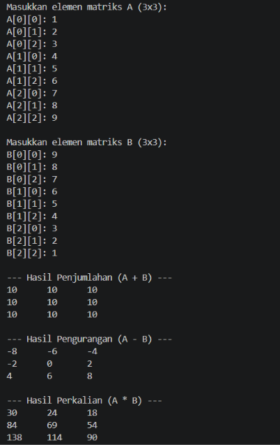
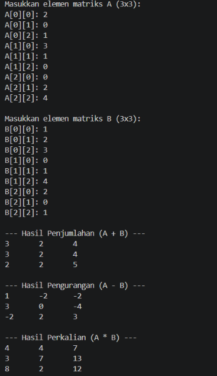
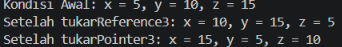
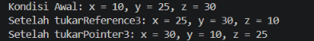
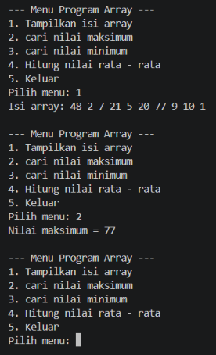
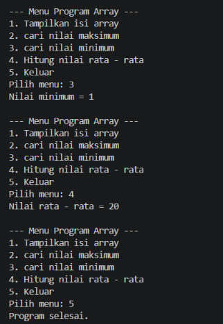

# <h1 align="center">Laporan Praktikum Modul 2 - Codeblocks IDE & Pengenalan Bahasa C++ (Bagian Kedua)</h1>
<p align="center">Muhammad Rozi Lazuardi - 109082500188</p>

## Dasar Teori

### 1. Array
Array merupakan kumpulan variabel bertipe data sama yang disimpan secara berurutan dalam memori komputer dan diakses menggunakan indeks[cite: 4].
* **Array Satu Dimensi:** Memiliki satu deret elemen data dengan bentuk deklarasi `tipe_data nama_var[ukuran]` di mana indeks dimulai dari 0[cite: 4].
* **Array Dua Dimensi:** Memiliki susunan data seperti tabel yang terdiri dari baris dan kolom dengan dua indeks pengaksesan, dideklarasikan dalam bentuk `tipe_data nama_var[baris][kolom]`[cite: 4].
* **Array Banyak Dimensi:** Memiliki lebih dari dua indeks pengaksesan untuk menyimpan struktur data yang lebih kompleks[cite: 5].

### 2. Pointer dan Memori
* **Alokasi Memori:** Setiap variabel yang dibuat akan dialokasikan pada memori (RAM) dengan alamat unik[cite: 5]. Alamat memori suatu variabel dapat diketahui menggunakan operator ampersand (`&`)[cite: 5].
* **Pointer:** Merupakan variabel khusus yang menyimpan alamat memori dari variabel lain[cite: 6]. Pointer dideklarasikan dengan tanda asterisk (`*`) di depan nama variabel, misalnya `int *p_int`[cite: 6]. Nilai dari variabel yang ditunjuk pointer dapat diakses menggunakan operator dereference (`*`)[cite: 6].
* **Pointer dan Array:** Nama array pada dasarnya bertindak sebagai pointer yang menunjuk ke elemen pertamanya (`&a[0]`), sehingga operasi elemen array dapat diakses menggunakan aritmetika pointer (`pa + i`)[cite: 7, 8].

### 3. Fungsi dan Prosedur
* **Fungsi:** Subprogram yang menerima masukan (parameter), mengolah data, dan memberikan nilai balik (*return value*)[cite: 10]. Dideklarasikan dalam bentuk `tipe_keluaran nama_fungsi(daftar_parameter)`[cite: 10].
* **Prosedur:** Fungsi dalam C++ yang tidak mengembalikan nilai balik (menggunakan tipe `void`)[cite: 10]. Digunakan untuk menjalankan serangkaian instruksi tugas tertentu[cite: 10].

### 4. Parameter Fungsi dan Mekanisme Pass by Parameter
* **Parameter Formal dan Aktual:** Parameter formal adalah variabel pada deklarasi fungsi, sedangkan parameter aktual adalah nilai/variabel yang dikirimkan saat pemanggilan fungsi[cite: 11].
* **Call by Value:** Nilai parameter aktual disalin ke parameter formal, sehingga perubahan di dalam fungsi tidak memengaruhi nilai variabel asli di luar fungsi[cite: 11, 12].
* **Call by Pointer:** Fungsi menerima alamat memori variabel dengan parameter bertipe pointer (`*`) dan dipanggil dengan mengirimkan alamat (`&`)[cite: 12]. Perubahan di dalam fungsi akan langsung mengubah variabel asli[cite: 12].
* **Call by Reference:** Fungsi menerima alias variabel menggunakan simbol ampersand (`&`) pada parameter formal[cite: 12, 13]. Pemanggilan dilakukan seperti *call by value* biasa, tetapi perubahan di dalam fungsi akan langsung mengubah variabel asli[cite: 13].

## Guided 

### 1. Array 1

```C++
#include <iostream>
using namespace std;

int main() {
    int nilai[5];

    nilai[0] = 80;
    nilai[1] = 75;
    nilai[2] = 90;
    nilai[3] = 85;
    nilai[4] = 95;

    for (int i = 0; i < 5; i++) {
        cout << "Nilai ke-" << i + 1 << "="
        << nilai [i] << endl;
    }

    return 0;
}
```
Program tersebut digunakan untuk menyimpan dan menampilkan lima data nilai menggunakan array satu dimensi bertipe integer. Pertama, program mendeklarasikan array bernama nilai dengan kapasitas lima elemen, kemudian mengisi masing-masing indeks dari nilai[0] hingga nilai[4] dengan angka tertentu. Setelah seluruh nilai tersimpan, perulangan for dijalankan untuk mengakses elemen array secara berurutan berdasarkan indeksnya dan mencetak pesan "Nilai ke-x" beserta isinya ke layar.

### 2. Array 2

```C++
#include <iostream>
using namespace std;

int main() {
    int nilai[3][3] = {
        {80, 75, 90},
        {85, 90, 88},
        {70, 80, 85}
    };

    for (int i = 0; i < 3; i++) {
        for (int j = 0; j < 3; j++) {
            cout << nilai[i][j] << " ";
        }
        cout << endl;
    }

    cout << endl;
    cout << nilai[1][2] << endl;
    return 0;
}
```
Program tersebut digunakan untuk menyimpan dan menampilkan data nilai dalam bentuk matriks 3x3 menggunakan array dua dimensi bertipe integer. Pertama, program mendefinisikan array nilai berukuran 3 baris dan 3 kolom yang langsung diisi dengan sembilan angka. Selanjutnya, perulangan for bersarang digunakan untuk mencetak seluruh elemen array berdasarkan baris dan kolomnya sehingga membentuk tampilan tabel atau matriks di layar. Di akhir program, baris kode cout << nilai[1][2] secara spesifik mengambil dan mencetak elemen yang berada di baris kedua dan kolom ketiga, yaitu angka 88.

### 3. Array 3

```C++
#include <iostream>
using namespace std;

int main() {
    int data[2][2][3] = {
        {
            {10, 20, 30},
            {40, 50, 60}
        },
        {
            {70, 80, 90},
            {100, 110, 120}
        }
    };

    cout << data[0][1][2] << endl;

    return 0;
}
```
Program tersebut digunakan untuk menginisialisasi dan menampilkan elemen tertentu dari array tiga dimensi bertipe integer. Pertama, program mendeklarasikan array tiga dimensi bernama data berukuran 2x2x3 yang memuat dua buah matriks 2x3 berisi angka kelipatan sepuluh dari 10 hingga 120. Selanjutnya, baris kode cout << data[0][1][2] secara spesifik mengakses dan mencetak nilai pada blok pertama (indeks 0), baris kedua (indeks 1), dan kolom ketiga (indeks 2), sehingga menghasilkan luaran angka 60 di layar.

### 4. Adress

```C++
#include<iostream>
using namespace std;

int main() {
    int angka = 100;

    cout << "Nilai angka : " << angka << endl;
    cout << "Alamat angka : " << &angka << endl;

    return 0;
}
```
Program tersebut digunakan untuk menampilkan nilai dari sebuah variabel beserta lokasi alamat memorinya menggunakan operator address-of (&). Pertama, program mendeklarasikan variabel bertipe integer bernama angka yang diisi dengan nilai 100. Selanjutnya, program mencetak kalimat "Nilai angka : " diikuti oleh isi dari variabel tersebut, kemudian mencetak "Alamat angka : " diikuti oleh &angka yang menampilkan lokasi memori (dalam format heksadesimal) tempat nilai tersebut disimpan di dalam komputer.

### 5. Pointer

```C++
#include <iostream>
using namespace std;

int main() {
    char arr[6];

    arr[0] = 'a';
    arr[1] = 'b';
    arr[2] = 'c';
    arr[3] = 'b';
    arr[4] = 'd';
    arr[5] = 'e';

    cout << arr[3] << endl; //value
    cout << &(arr[4]) << endl; //alamat memory atau address

    return 0;
}
```
Program tersebut digunakan untuk menyimpan sekumpulan karakter di dalam array satu dimensi dan menampilkan elemen serta alamat memori tertentu. Pertama, program mendeklarasikan array bertipe char bernama arr dengan kapasitas enam elemen yang masing-masing diisi dengan karakter 'a' hingga 'e'. Selanjutnya, perintah cout << arr[3] mencetak karakter pada indeks ketiga yaitu huruf 'b', diikuti perintah cout << &(arr[4]) yang mencoba mencetak alamat memori dari elemen indeks keempat.

### 6. Function

```C++
#include <iostream>
using namespace std;

int main() {
    int angka = 100;

    int *pointer;

    pointer = &angka;

    cout << "Nilai angka       : " << angka << endl; //100
    cout << "Alamat angka      : " << &angka << endl; //address
    cout << "Isi pointer       : " << pointer << endl; //addres angka
    cout << "Nilai dari pointer: " << *pointer << endl; //value angka (100)

    return 0;
}
```
Program tersebut digunakan untuk menunjukkan cara kerja pointer dalam menyimpan alamat memori dan mengakses nilai variabel lain. Variabel pointer diisi dengan alamat memori angka (&angka), lalu program mencetak nilai asli, alamat memori, isi pointer (alamat angka), dan nilai yang ditunjuk pointer (*pointer) yaitu 100.

### 7. Procedure

```C++
#include <iostream>
using namespace std;

int maks3(int a, int b, int c) {
    int temp_max = a;

    if (b > temp_max)
        temp_max = b;

    if (c > temp_max)
        temp_max = c;

    return temp_max;
}

int main() {
    int x, y, z;

    cout << "Masukkan nilai 1: ";
    cin >> x;

    cout << "Masukkan nilai 2: ";
    cin >> y;

    cout << "Masukkan nilai 3: ";
    cin >> z;

    cout << "Nilai maksimum = "
         << maks3(x, y, z);

    return 0;
}
```
Program tersebut digunakan untuk mencari dan menampilkan nilai terbesar dari tiga buah angka yang dimasukkan pengguna menggunakan fungsi tersendiri. Pertama, program meminta input tiga angka (x, y, z), lalu memanggil fungsi maks3 untuk membandingkan ketiga angka tersebut secara bertahap hingga menemukan nilai maksimum. Hasil nilai terbesar yang dikembalikan oleh fungsi kemudian dicetak langsung ke layar.

### 8. Call by value

```C++
#include <iostream>
using namespace std;

void sapa() {
    cout << "Selamat datang di Praktikum Struktur Data" << endl;
}

int main () {
    sapa();
    return 0;
}
```
Program tersebut digunakan untuk menunjukkan cara membuat dan memanggil fungsi tanpa nilai balik (void function) dalam bahasa C++. Pertama, fungsi bernama sapa() didefinisikan untuk mencetak pesan ucapan selamat datang ke layar. Di dalam fungsi utama main(), fungsi sapa() dipanggil sehingga pesan tersebut tampil saat program dijalankan.

### 9. Call by pointer

```C++
#include <iostream>
using namespace std;

void tukar(int *x, int *y) {
    int temp;

    temp = *x;
    *x = *y;
    *y = temp;
}

int main() {
    int a = 4;
    int b = 6;

    cout << "Sebelum ditukar:" << endl;
    cout << "a = " << a << endl;
    cout << "b = " << b << endl;

    tukar(&a, &b);

    cout << "\nSetelah ditukar:" << endl;
    cout << "a = " << a << endl;
    cout << "b = " << b << endl;

    return 0;
}
```
Program tersebut digunakan untuk menukar nilai dua variabel menggunakan mekanisme call by pointer. Fungsi tukar menerima alamat memori variabel a dan b melalui parameter pointer x dan y, lalu menukar isi kedua variabel tersebut menggunakan variabel bantu temp. Setelah fungsi dipanggil dengan tukar(&a, &b), nilai a yang awalnya 4 berubah menjadi 6 dan nilai b yang awalnya 6 berubah menjadi 4.


## Unguided 

### 1. Buatlah program yang dapat melakukan operasi penjumlahan, pengurangan, dan perkalian matriks 3x3  

```C++
#include <iostream>
using namespace std;

const int N = 3;

void inputMatriks(int M[N][N], char nama) {
    cout << "Masukkan elemen matriks " << nama << " (3x3):\n";
    for (int i = 0; i < N; i++) {
        for (int j = 0; j < N; j++) {
            cout << nama << "[" << i << "][" << j << "]: ";
            cin >> M[i][j];
        }
    }
}

void cetakMatriks(const int M[N][N]) {
    for (int i = 0; i < N; i++) {
        for (int j = 0; j < N; j++) {
            cout << M[i][j] << "\t";
        }
        cout << endl;
    }
}

void tambahMatriks(const int A[N][N], const int B[N][N], int C[N][N]) {
    for (int i = 0; i < N; i++)
        for (int j = 0; j < N; j++)
            C[i][j] = A[i][j] + B[i][j];
}

void kurangMatriks(const int A[N][N], const int B[N][N], int C[N][N]) {
    for (int i = 0; i < N; i++)
        for (int j = 0; j < N; j++)
            C[i][j] = A[i][j] - B[i][j];
}

void kaliMatriks(const int A[N][N], const int B[N][N], int C[N][N]) {
    for (int i = 0; i < N; i++) {
        for (int j = 0; j < N; j++) {
            C[i][j] = 0;
            for (int k = 0; k < N; k++) {
                C[i][j] += A[i][k] * B[k][j];
            }
        }
    }
}

int main() {
    int A[N][N], B[N][N], Hasil[N][N];

    inputMatriks(A, 'A');
    cout << endl;
    inputMatriks(B, 'B');

    cout << "\n--- Hasil Penjumlahan (A + B) ---\n";
    tambahMatriks(A, B, Hasil);
    cetakMatriks(Hasil);

    cout << "\n--- Hasil Pengurangan (A - B) ---\n";
    kurangMatriks(A, B, Hasil);
    cetakMatriks(Hasil);

    cout << "\n--- Hasil Perkalian (A * B) ---\n";
    kaliMatriks(A, B, Hasil);
    cetakMatriks(Hasil);

    return 0;
}
```
### Output Unguided 1 :

##### Output 1


##### Output 2


Program tersebut digunakan untuk melakukan operasi aritmetika pada dua buah matriks 3x3 menggunakan fungsi dan array dua dimensi. Pertama, program menerima masukan elemen untuk matriks A dan B melalui prosedur inputMatriks. Selanjutnya, program memanggil prosedur tambahMatriks, kurangMatriks, dan kaliMatriks untuk menghitung hasil operasi antar-elemen matriks, yang kemudian dicetak ke layar dalam bentuk matriks rapi menggunakan prosedur cetakMatriks.

### 2. Berdasarkan guided pointer dan reference sebelumnya, buatlah keduanya dapat menukar nilai dari 3 variabel  

```C++
#include <iostream>
using namespace std;

void tukarReference3(int &a, int &b, int &c) {
    int temp = a;
    a = b;
    b = c;
    c = temp;
}

void tukarPointer3(int *a, int *b, int *c) {
    int temp = *a;
    *a = *b;
    *b = *c;
    *c = temp;
}

int main() {
    int x = 5, y = 10, z = 15;

    cout << "Kondisi Awal: x = " << x << ", y = " << y << ", z = " << z << endl;

    tukarReference3(x, y, z);
    cout << "Setelah tukarReference3: x = " << x << ", y = " << y << ", z = " << z << endl;

    tukarPointer3(&x, &y, &z);
    cout << "Setelah tukarPointer3: x = " << x << ", y = " << y << ", z = " << z << endl;

    return 0;
}
```
### Output Unguided 2 :

##### Output 1


##### Output 2


Program tersebut digunakan untuk menggeser nilai dari tiga variabel (x, y, z) secara berantai menggunakan dua metode berbeda, yaitu Call by Reference dan Call by Pointer. Dalam kedua fungsi tersebut, nilai dialihkan secara berurutan dengan variabel bantuan temp, sehingga nilai y berpindah ke x, nilai z berpindah ke y, dan nilai awal x berpindah ke z. Pemanggilan berturut-turut pada tukarReference3 dan tukarPointer3 mengubah kondisi nilai x, y, z dari yang semula 5, 10, 15 menjadi 10, 15, 5, lalu akhirnya menjadi 15, 5, 10.

### 3. Diketahui sebuah array 1 dimensi sebagai berikut :  arrA = {11, 8, 5, 7, 12, 26, 3, 54, 33, 55} Buatlah program yang dapat mencari nilai minimum, maksimum, dan rata – rata dari array tersebut! Gunakan function cariMinimum() untuk mencari nilai minimum dan function cariMaksimum() untuk mencari nilai maksimum, serta gunakan prosedur hitungRataRata() untuk menghitung nilai rata – rata! Buat program menggunakan menu switch-case seperti berikut ini : --- Menu Program Array ---  • Tampilkan isi array  • cari nilai maksimum • cari nilai minimum  • Hitung nilai rata - rata 

```C++
#include <iostream>
using namespace std;

int cariMaksimum(int arr[], int n) {
    int maks = arr[0];
    for (int i = 1; i < n; i++) {
        if (arr[i] > maks) {
            maks = arr[i];
        }
    }
    return maks;
}

int cariMinimum(int arr[], int n) {
    int min = arr[0];
    for (int i = 1; i < n; i++) {
        if (arr[i] < min) {
            min = arr[i];
        }
    }
    return min;
}

void hitungRataRata(int arr[], int n, float &rata) {
    float total = 0;
    for (int i = 0; i < n; i++) {
        total += arr[i];
    }
    rata = total / n;
}

void tampilkanArray(int arr[], int n) {
    cout << "Isi array: ";
    for (int i = 0; i < n; i++) {
        cout << arr[i] << " ";
    }
    cout << endl;
}

int main() {
    int arrA[] = {48, 2, 7, 21, 5, 20, 77, 9, 10, 1};
    int n = sizeof(arrA) / sizeof(arrA[0]);
    int pilihan;
    float rataRata = 0;

    do {
        cout << "\n--- Menu Program Array ---\n";
        cout << "1. Tampilkan isi array\n";
        cout << "2. cari nilai maksimum\n";
        cout << "3. cari nilai minimum\n";
        cout << "4. Hitung nilai rata - rata\n";
        cout << "5. Keluar\n";
        cout << "Pilih menu: ";
        cin >> pilihan;

        switch (pilihan) {
            case 1:
                tampilkanArray(arrA, n);
                break;
            case 2:
                cout << "Nilai maksimum = " << cariMaksimum(arrA, n) << endl;
                break;
            case 3:
                cout << "Nilai minimum = " << cariMinimum(arrA, n) << endl;
                break;
            case 4:
                hitungRataRata(arrA, n, rataRata);
                cout << "Nilai rata - rata = " << rataRata << endl;
                break;
            case 5:
                cout << "Program selesai." << endl;
                break;
            default:
                cout << "Pilihan tidak valid!" << endl;
        }
    } while (pilihan != 5);

    return 0;
}
```
### Output Unguided 3 :

##### Output 1


##### Output 2


Program tersebut merupakan program berbasis menu interaktif yang digunakan untuk mengolah sekumpulan elemen array satu dimensi secara berulang hingga pengguna memilih untuk keluar. Melalui perulangan do-while dan percabangan switch-case, program menyediakan opsi untuk menampilkan isi array, mencari nilai maksimum, mencari nilai minimum, serta menghitung rata-rata elemen menggunakan fungsi dan prosedur terpisah.

## Kesimpulan
Materi kali ini membahas tentang konsep dasar pemrosesan data dan pengalokasian memori dalam C++ melalui penggunaan array multi-dimensi, pemisahan logika program menggunakan fungsi dan prosedur, serta pengelolaan alamat memori menggunakan pointer dan reference.

Penggunaan array satu hingga tiga dimensi memungkinkan penyimpanan sekumpulan data secara terstruktur dan efisien. Pemisahan kode ke dalam fungsi (return value) dan prosedur (void) mempermudah pengelolaan program, modularitas, serta keterbacaan kode. Selain itu, pemahaman mendasar mengenai alamat memori menjadi kunci dalam membedakan metode pengiriman parameter: Call by Value yang menyalin nilai variabel asli, Call by Reference yang memanfaatkan simbol alias (&), dan Call by Pointer yang menggunakan variabel penunjuk alamat (* dan &) untuk memanipulasi data secara langsung pada lokasi memorinya.

## Referensi
[1] Triase. (2020). Diktat Edisi Revisi : STRUKTUR DATA. Medan: UNIVERSTAS ISLAM NEGERI SUMATERA UTARA MEDAN. 
<br>[2] Indahyati, Uce., Rahmawati Yunianita. (2020). "BUKU AJAR ALGORITMA DAN PEMROGRAMAN DALAM BAHASA C++". Sidoarjo: Umsida Press. Diakses pada 10 Maret 2024 melalui https://doi.org/10.21070/2020/978-623-6833-67-4.
<br>...
