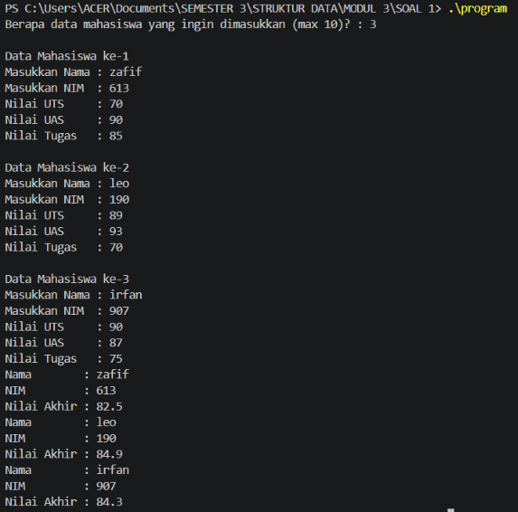
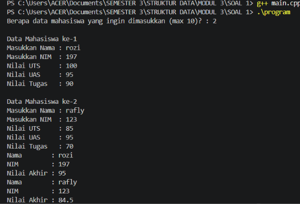
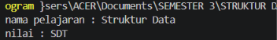
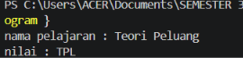
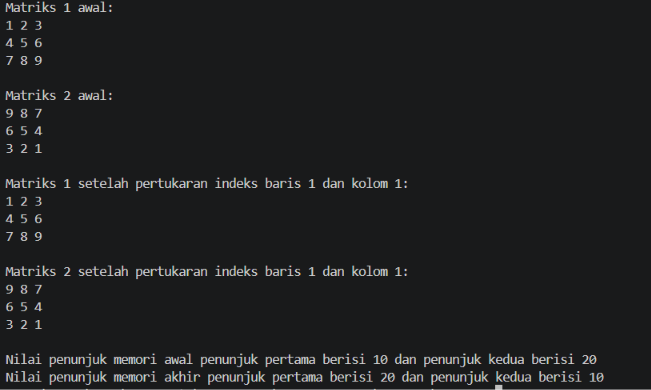
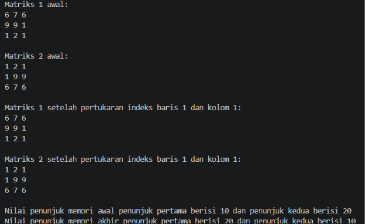

# <h1 align="center">Laporan Praktikum Modul 3 - ABSTRACT DATA TYPE</h1>
<p align="center">Muhammad Rozi Lazuardi - 109082500188</p>


## Dasar Teori

### 1. Abstract Data Type (ADT)

ADT atau Tipe Data Abstrak adalah model matematis untuk tipe data tertentu yang didefinisikan berdasarkan sekumpulan nilai dan operasi dasar (primitif) terhadap tipe tersebut.

* **Sifat ADT:** Bersifat statis dan dapat tersusun dari definisi ADT lain, seperti ADT waktu yang terdiri dari gabungan ADT jam dan ADT tanggal.


* **Representasi Pemrograman:** Dalam pemrograman prosedural C++, tipe data diterjemahkan menjadi tipe terdefinisi seperti `struct`, sedangkan operasi primitif diterjemahkan menjadi fungsi atau prosedur.


### 2. Kelompok Operasi Primitif ADT

Operasi-operasi dasar yang membentuk sebuah ADT dikelompokkan ke dalam beberapa fungsi utama:

* **Konstruktor/Kreator:** Pembentuk nilai tipe data (biasanya diawali dengan `Make`).


* **Selektor:** Digunakan untuk mengakses nilai dari komponen tipe data (biasanya diawali dengan `Get`).


* **Prosedur Pengubah:** Digunakan untuk mengubah nilai dari komponen tipe data.


* **Destruktor/Dealokator:** Digunakan untuk menghancurkan variabel beserta alokasi memori penyimpanannya.


* **Operasi Aritmetika dan Relasional:** Mendefinisikan operasi perhitungan serta perbandingan (`>`, `<`, `==`) khusus untuk tipe data tersebut.


### 3. Implementasi Modularisasi ADT

ADT diimplementasikan ke dalam program dengan memisahkannya menjadi tiga file terpisah:

* **Header File (`.h`):** Berisi definisi struktur data (`struct`) serta deklarasi prototipe fungsi dan prosedur primitif.


* **Realisasi File (`.cpp`):** Berisi kode program aktual atau penjabaran dari fungsi dan prosedur yang terdefinisi di file header.


* **Program Utama (`main.cpp`):** Berperan sebagai penguji (*driver*) yang memanggil modul-modul ADT untuk menjalankan program utama.

## Guided 

### 1. Guided

### mahasiswa.h

```C++
#ifndef MAHASISWA_H_INCLUDED
#define MAHASISWA_H_INCLUDED

struct Mahasiswa {
    char nim [10];
    int nilai1, nilai2;
};

void inputMhs (Mahasiswa &m) ;
float rata2 (Mahasiswa m) ;
#endif
```
### nilai.Mahasiswa.cpp
```C++
#include <iostream>
#include "nilaiMahasiswa.h"

using namespace std;

void inputData(Mhs &m) {
    cout << "Masukkan Nama : ";
    cin.ignore();
    getline(cin, m.nama);
    cout << "Masukkan NIM  : ";
    cin >> m.nim;
    cout << "Nilai UTS     : ";
    cin >> m.uts;
    cout << "Nilai UAS     : ";
    cin >> m.uas;
    cout << "Nilai Tugas   : ";
    cin >> m.tugas;
    
    m.akhir = (0.3 * m.uts) + (0.4 * m.uas) + (0.3 * m.tugas);
}

void tampilData(Mhs m) {
    cout << "Nama        : " << m.nama << endl;
    cout << "NIM         : " << m.nim << endl;
    cout << "Nilai Akhir : " << m.akhir << endl;
}
```

### main.cpp
```C++
#include <iostream>
#include "mahasiswa.h"
using namespace std;

int main() {
    Mahasiswa mhs;
    inputMhs(mhs);
    cout << "Rata-rata nilai = " << rata2(mhs) << endl;
    return 0;
}
```
Kode ini menerapkan pemrograman modular berkonsep Abstract Data Type (ADT) yang membagi logika program pengelolaan data mahasiswa ke dalam tiga file terpisah, yakni `mahasiswa.h`, `nilai.Mahasiswa.cpp`, serta `main.cpp`. File header menyimpan definisi `struct` dan deklarasi fungsi, sedangkan file realisasinya memuat prosedur penginputan data secara *pass-by-reference* beserta kalkulasi nilai akhir. Terakhir, file utama bertugas membuat objek mahasiswa dan mengeksekusi fungsi-fungsi tersebut untuk menampilkan output ke layar.


## Unguided 

### 1. Buat program yang dapat menyimpan data mahasiswa (max. 10) ke dalam sebuah array dengan field nama, nim, uts, uas, tugas, dan nilai akhir. Nilai akhir diperoleh dari FUNGSI dengan rumus 0.3*uts+0.4*uas+0.3*tugas. 

### nilai.Mahasiswa.h
```C++
#ifndef NILAIMAHASISWA_H
#define NILAIMAHASISWA_H
#include <string>

using namespace std;

struct Mhs {
    string nama;
    string nim;
    float uts;
    float uas;
    float tugas;
    float akhir;
};

void inputData(Mhs &m);
void tampilData(Mhs m);

#endif
```

### nilai.Mahasiswa.cpp
```C++
#include <iostream>
#include "nilaiMahasiswa.h"

using namespace std;

void inputData(Mhs &m) {
    cout << "Masukkan Nama : ";
    cin.ignore();
    getline(cin, m.nama);
    cout << "Masukkan NIM  : ";
    cin >> m.nim;
    cout << "Nilai UTS     : ";
    cin >> m.uts;
    cout << "Nilai UAS     : ";
    cin >> m.uas;
    cout << "Nilai Tugas   : ";
    cin >> m.tugas;
    
    m.akhir = (0.3 * m.uts) + (0.4 * m.uas) + (0.3 * m.tugas);
}

void tampilData(Mhs m) {
    cout << "Nama        : " << m.nama << endl;
    cout << "NIM         : " << m.nim << endl;
    cout << "Nilai Akhir : " << m.akhir << endl;
}
```

### main.cpp
```C++
#include <iostream>
#include "nilaiMahasiswa.h"

using namespace std;

int main() {
    Mhs data[10];
    int n = 0;
    
    cout << "Berapa data mahasiswa yang ingin dimasukkan (max 10)? : ";
    cin >> n;
    
    if(n > 10) n = 10;
    
    for(int i = 0; i < n; i++) {
        cout << "\nData Mahasiswa ke-" << i+1 << endl;
        inputData(data[i]);
    } 
    
    for(int i = 0; i < n; i++) {
        tampilData(data[i]);
    }
    
    return 0;
}
```
### Output Unguided 1 :

##### Output 1


##### Output 2


Program ini menerapkan konsep ADT modular dengan membagi pustaka `nilai.Mahasiswa` menjadi file header, file realisasi, dan *main program*. Pada bagian realisasi, fungsi `inputData` memproses variabel `Mhs` secara *pass-by-reference* guna membaca input komponen nilai sekaligus mengkalkulasi bobot nilai akhirnya secara otomatis. Selanjutnya, file `main.cpp` mendeklarasikan larik struktur untuk menyimpan entitas data mahasiswa sesuai jumlah masukan pengguna, kemudian mengulang pemanggilan `tampilData` guna menyajikan rekap data ke layar.

### 2. ADT pelajaran

### main.cpp
```C++
#include <iostream>
#include <string>
#include "pelajaran.h"

using namespace std;

int main() {
    string namapel = "Teori Peluang";
    string kodepel = "TPL";
    pelajaran pel = create_pelajaran(namapel, kodepel);
    tampil_pelajaran(pel);
    
    return 0;
}
```

### pelajaran.cpp
```C++
#include <iostream>
#include "pelajaran.h"

using namespace std;

pelajaran create_pelajaran(string namapel, string kodepel) {
    pelajaran p;
    p.namaMapel = namapel;
    p.kodeMapel = kodepel;
    return p;
}

void tampil_pelajaran(pelajaran pel) {
    cout << "nama pelajaran : " << pel.namaMapel << endl;
    cout << "nilai : " << pel.kodeMapel << endl;
}
```

### pelajaran.h
```C++
#ifndef PELAJARAN_H
#define PELAJARAN_H
#include <string>

using namespace std;

struct pelajaran {
    string namaMapel;
    string kodeMapel;
};

pelajaran create_pelajaran(string namapel, string kodepel);
void tampil_pelajaran(pelajaran pel);

#endif
```
### Output Unguided 2 :

##### Output 1

##### Output 2


Kode ini menerapkan prinsip enkapsulasi ADT dengan memisahkan definisi tipe data `pelajaran` ke dalam file `pelajaran.h`, `pelajaran.cpp`, dan `main.cpp`. File realisasi menyediakan fungsi `create_pelajaran` untuk membuat serta menginisialisasi objek `pelajaran` baru, dan prosedur `tampil_pelajaran` untuk mencetak datanya. Di file `main.cpp`, program cukup memanggil fungsi pembentuk tersebut dengan argumen nama dan kode mata kuliah, lalu meneruskannya ke fungsi penampil untuk menyajikan informasi ke layar.

### 3. Program Penukaran Elemen Array Dua Dimensi dan Variabel Pointer.

### main.cpp
```C++
#include <iostream>
#include "array.h"

using namespace std;

int main() {
    int matriks1[3][3] = {
        {6, 7, 6},
        {9, 9, 1},
        {1, 2, 1}
    };

    int matriks2[3][3] = {
        {1, 2, 1},
        {1, 9, 9},
        {6, 7, 6}
    };

    cout << "Matriks 1 awal:" << endl;
    tampilArray(matriks1);

    cout << "\nMatriks 2 awal:" << endl;
    tampilArray(matriks2);

    tukarPosisiArray(matriks1, matriks2, 1, 1);

    cout << "\nMatriks 1 setelah pertukaran indeks baris 1 dan kolom 1:" << endl;
    tampilArray(matriks1);

    cout << "\nMatriks 2 setelah pertukaran indeks baris 1 dan kolom 1:" << endl;
    tampilArray(matriks2);

    int val1 = 10;
    int val2 = 20;

    cout << "\nNilai penunjuk memori awal penunjuk pertama berisi " << val1 
         << " dan penunjuk kedua berisi " << val2 << endl;

    tukarPointer(&val1, &val2);

    cout << "Nilai penunjuk memori akhir penunjuk pertama berisi " << val1 
         << " dan penunjuk kedua berisi " << val2 << endl;

    return 0;
}
```

### array.cpp
```C++
#include <iostream>
#include "array.h"

using namespace std;

void tampilArray(int arr[3][3]) {
    for (int i = 0; i < 3; i++) {
        for (int j = 0; j < 3; j++) {
            cout << arr[i][j] << " ";
        }
        cout << endl;
    }
}

void tukarPosisiArray(int arr1[3][3], int arr2[3][3], int baris, int kolom) {
    int temp = arr1[baris][kolom];
    arr1[baris][kolom] = arr2[baris][kolom];
    arr2[baris][kolom] = temp;
}

void tukarPointer(int *p1, int *p2) {
    int temp = *p1;
    *p1 = *p2;
    *p2 = temp;
}
```

### array.h
```C++
#ifndef ARRAY_H
#define ARRAY_H

void tampilArray(int arr[3][3]);
void tukarPosisiArray(int arr1[3][3], int arr2[3][3], int baris, int kolom);
void tukarPointer(int *p1, int *p2);

#endif
```
### Output Unguided 3 :

##### Output 1

##### Output 2


Program ini mendemonstrasikan manipulasi array dua dimensi dan penggunaan pointer secara modular dengan membagi pustaka ke dalam `array.h`, `array.cpp`, dan `main.cpp`. Prosedur `tukarPosisiArray` mengubah nilai elemen matriks pada posisi baris dan kolom tertentu melalui penukaran langsung, sementara `tukarPointer` menggunakan mekanisme *call-by-pointer* untuk menukar nilai dua variabel memori melalui alamatnya. Pada file `main.cpp`, program menginisialisasi dua matriks berukuran 3x3 beserta dua variabel integer untuk menampilkan kondisi nilai sebelum dan sesudah proses pertukaran ke layar.

## Kesimpulan
Praktikum Modul 3 mengenai Abstract Data Type (ADT) membuktikan bahwa pemisahan kode ke dalam file header (`.h`), realisasi (`.cpp`), dan program utama (`main.cpp`) berhasil meningkatkan keterbacaan serta pemeliharaan kode melalui pemrograman modular. Selain itu, penggunaan tipe data `struct` mempermudah pengelompokan data majemuk seperti entitas mahasiswa dan pelajaran. Terakhir, penerapan mekanisme *pass-by-reference* dan *call-by-pointer* terbukti sangat efektif untuk memanipulasi nilai variabel maupun elemen array dua dimensi secara langsung pada alamat memorinya.

## Referensi
[1] F. M. Carrano and T. Henry, Data Abstraction & Problem Solving with C++: Walls and Mirrors, 7th ed. Boston, MA, USA: Pearson, 2016.

[2] P. Deitel and H. Deitel, C++ How to Program, 10th ed. Upper Saddle River, NJ, USA: Pearson, 2017.

[3] A. Kristanto, Struktur Data dengan C++. Yogyakarta, Indonesia: Graha Ilmu, 2009.